<p align="center">
  
</p>

<h1 align="center">KHAOS</h1>

<p align="center">
  <strong>We just don't bring chaos — We are the KHAOS.</strong><br>
  The elite CTF organization pushing the boundaries of cybersecurity.
</p>

---

## ◈ Mission Briefing

Khaos is a production-grade, tactical CTF team website built for performance and elite visual identity. This repository contains the source code for the platform, leveraging modern web technologies to ensure a "blazing fast" and secure experience.

<details>
<summary><b>⚡ Tech Intel (The Stack)</b></summary>

- **Framework**: [Astro 6.3+](https://astro.build) (SSG)
- **Styling**: [Tailwind CSS v4](https://tailwindcss.com) (Vite-based integration)
- **Interactivity**: [Vue 3](https://vuejs.org) (Islands Architecture)
- **Icons**: [Lucide](https://lucide.dev)
- **Fonts**: Geist Sans & Mono
- **Content**: Astro Content Collections (Markdown/JSON)

</details>

<details>
<summary><b>🛠 Operational Procedures (Local Development)</b></summary>

### Prerequisites
- Node.js 20+
- npm

### Commands
```bash
# Clone the perimeter
git clone <repo-url>

# Install dependencies
npm install

# Initiate development server
npm run dev

# Build for deployment
npm run build

# Preview production build
npm run preview
```

</details>

<details>
<summary><b>📂 Intelligence Gathering (Data Maintenance)</b></summary>

The platform is designed to be easily updated through structured data files.

### Updating Team Members
The team data is centralized in [teamData.ts](file:///home/havoc/Documents/khaos-website/src/utils/teamData.ts). 

#### How to add a new member:
1. Open `src/utils/teamData.ts`.
2. Add a new object to the `members` array following this structure:
```typescript
{
  name: 'Handle',
  role: 'Primary Domain',
  bio: 'Brief operative background.',
  socials: [
    { platform: 'github', url: 'https://github.com/...' },
    { platform: 'twitter', url: 'https://twitter.com/...' }
  ],
  // Option 1: Use tactical icons
   image: 'icon:Skull', // Options: Skull, Shield, Cpu, Ghost, Target, Terminal
   
   // Option 2: Use local tactical SVGs/Images
   image: '/images/avatars/skull.svg', // Custom hacker assets
   
   skills: ['Web', 'Pwn', 'Crypto']
 }
```
- **Auto-Sync**: Adding a member to this file will automatically update the "Elite Operatives" count on the Achievements page.
- **Socials**: Supports flexible platforms (GitHub, Twitter, Linktree, guns.lol).
- **Skills**: Add tags for specific domains (Web, Pwn, Crypto).
- **Images**: We support two "hacker" styles:
  1. **Tactical Icons**: Set `image` to `icon:NAME`. These are high-performance vector icons with neon effects.
  2. **Local Assets**: Place your custom hacker images (Masks, Skulls, etc.) in `public/images/avatars/` and reference the path directly (e.g., `/images/avatars/mask.svg`).

### Publishing Writeups
Create a new Markdown file in `content/writeups/`.
- Frontmatter requires: `title`, `description`, `pubDate`, `category`, `author`, `tags`.
- Support for images and codeblocks is built-in with high-end tactical rendering.

### Updating Achievements & Mission Reports
The Achievements page uses local data in [achievements.astro](src/pages/achievements.astro).
- **Stats**: Update the `stats` array at the top of the file to reflect total operations, points, and breaches.
- **Hall of Fame**: Add objects to the `hallOfFame` array for major podium finishes.
- **Mission Logs**: Add objects to the `missionLogs` array for a detailed timeline of participated CTFs.

### Upcoming Operations
To display upcoming CTFs:
1. Update the "Upcoming Operations" section in [achievements.astro](src/pages/achievements.astro).
2. Add a new JSON file in `content/events/` with `status: "upcoming"`. This will automatically appear on the separate **Events** page.

### Strategic Focus: Global Dominance
The team is currently focused on global dominance. Messaging across the site reflects this aggressive "KHAOS is here" stance.

</details>

<details>
<summary><b>🛰 Deployment Protocol</b></summary>

The site is optimized for static hosting (Vercel, Netlify, GitHub Pages).
1. Ensure `astro.config.mjs` has the correct `site` URL.
2. Run `npm run build`.
3. Deploy the `dist/` directory.

</details>

---

<p align="center">
  
  
</p>
